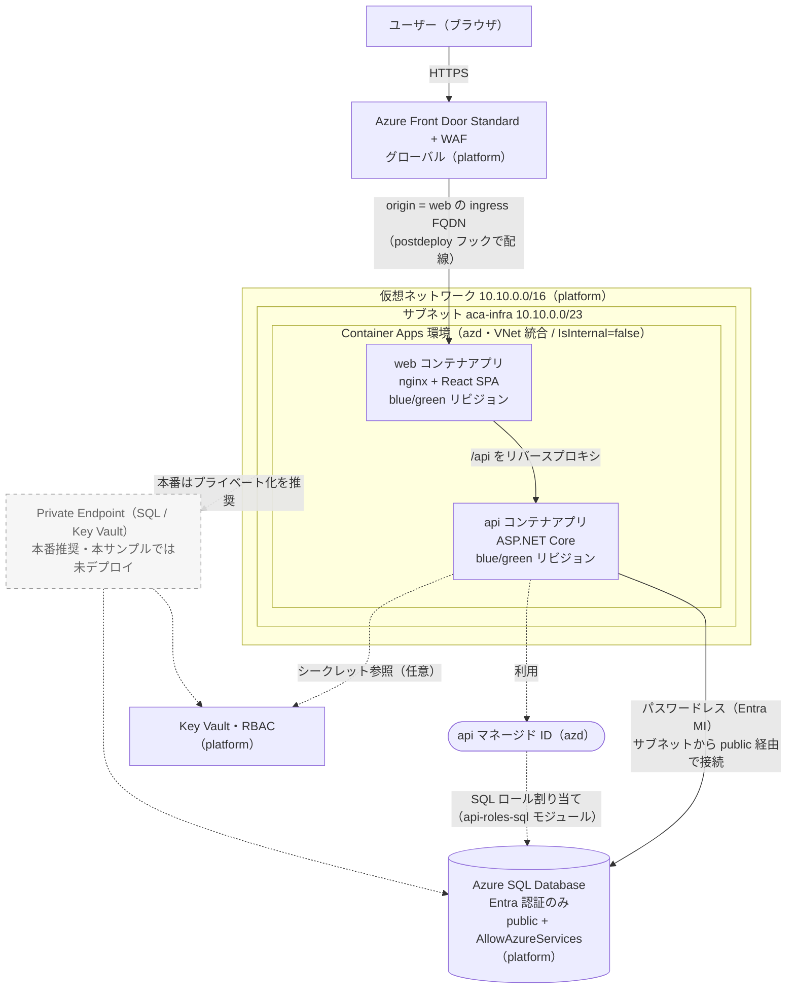

# Aspire blue/green on Azure Container Apps

`.NET 10 + Aspire` で構築した、**Azure Container Apps (ACA) 上で blue/green デプロイ**を実演するためのサンプルです。
`Aspireデプロイ戦略まとめ.md` の方針（外部リソースは AsExisting、アプリは `PublishAsAzureContainerApp`、差分は `azd provision --preview`）をそのまま実装しています。

- フロントエンド: **React (Vite)** — 本番は nginx コンテナで配信し `/api` を API へリバースプロキシ
- バックエンド: **ASP.NET Core (.NET 10)** — `/api/version`（SQL 非依存）/ `/api/orders`（SQL）
- デプロイ: **azd**（manifest モード = GA。`azd infra gen`/`aspire deploy` などの非 GA 機能は不使用）
- 外部リソース: **VNet / Azure SQL / Front Door**（`platform/` の Bicep で作成し、AppHost は外部参照）

> **GA 機能のみ**: AppHost は `dotnet build` で実験的 API 診断（`ASPIRE*`）が 0 件になることを確認済みです。

## アーキテクチャ



- **VNet 統合**: ACA 環境のインフラを platform VNet の委任サブネット `aca-infra`（`Microsoft.App/environments` に委任）へ注入します（`ConfigureInfrastructure`）。`IsInternal=false` のため ingress は外部公開で、Front Door が web を単一 origin として前段に置きます。
- **同一オリジン化**: ブラウザからの `/api/*` は web(nginx) が api の ingress へリバースプロキシ。Front Door はパス分岐なしで web のみを origin にします。api 自身も外部 ingress を持つため、green ラベル FQDN を直接検証できます。
- **SQL アクセス（パスワードレス）**: api はマネージド ID（Entra）で SQL に接続します（`AddAzureSqlServer().PublishAsExisting()` + `WithReference` が生成する `api-roles-sql` ロール割り当て）。SQL は Entra 認証のみ・public エンドポイント + `AllowAllAzureServices` 許可で、ACA サブネットから接続します。
- **Private Endpoint（本番推奨・未デプロイ）**: 本サンプルは簡略化のため SQL / Key Vault を public エンドポイントで利用します。本番では VNet 内に Private Endpoint を置き、`publicNetworkAccess` を無効化することを推奨します（図の点線）。
- **blue/green**: web・api の両方を ACA の複数リビジョンモードにし、`blue`/`green` ラベルでトラフィックを切り替えます。promote / rollback は **web と api を一括**で行い、2 ティアを常に揃えます。

> 図の凡例: 実線 = 本デモで作成するリソース・経路 / 点線 = 本番向けの推奨（本サンプルでは未デプロイ）。

## 戦略まとめとの対応

| リソース | 戦略まとめの分類 | 本サンプルの実装 |
| --- | --- | --- |
| ACA 環境 | `AddAzureContainerAppEnvironment`（GA） | AppHost。`ConfigureInfrastructure` で platform の VNet サブネットに統合 |
| フロント/バック | `PublishAsAzureContainerApp`（GA） | 複数リビジョンモード（Multiple） |
| SQL Database | `AsExisting`（GA） | `RunAsContainer()`（ローカル）+ `PublishAsExisting()`（Azure）。実体は `platform/` |
| VNet | 純インフラ + 付随設定 | `platform/`。ACA 環境を `ConfigureInfrastructure` でサブネット統合 |
| Front Door | 純インフラ（別デプロイ） | `platform/` で profile/endpoint/WAF/origin-group（空）。origin は postdeploy フックで配線 |
| 適用前差分 | `azd provision --preview`（GA） | `scripts/preview.ps1`（承認ゲート） |
| blue/green | 複数リビジョン + トラフィック分割 + ラベル（GA） | `scripts/bluegreen-*.ps1`（`az containerapp` ラッパー） |

## ディレクトリ構成

```text
AspireBlueGreen.AppHost/        Aspire AppHost（ACA 環境 + api/web + SQL + VNet 統合）
AspireBlueGreen.ServiceDefaults/ Aspire ServiceDefaults
src/Api/                        ASP.NET Core バックエンド
src/web/                        React + Vite フロント（+ Dockerfile / nginx）
platform/                       外部リソースの Bicep（VNet / SQL / Front Door / Key Vault）
scripts/                        azd ラッパー + blue/green スクリプト
azure.yaml                      azd 設定 + postdeploy フック
docs/demo-guide.md              デモ手順書（スクリプト版 / 日本語）
docs/demo-guide-manual.md       デモ手順書（手動実行版 / 日本語）
LICENSE                         MIT License
```

## 前提ツール

- .NET 10 SDK / Node.js 24+ / Docker（ローカル `aspire run` と publish 用）
- Azure CLI (`az`) と Azure Developer CLI (`azd`)
- PowerShell 7 (`pwsh`)
- （任意）`sqlcmd`（go-sqlcmd）— `grant-sql-access.ps1` を手動実行する場合のみ

## ローカル実行（Azure 不要）

```powershell
aspire run
```

- `aspire run`（run モード）では web は **Vite 開発サーバー**、SQL は **コンテナ**で起動します。
- ブラウザでバナー色 + バージョンが表示され、`/api/version` が応答します。`/api/orders` は SQL コンテナを使用します。

## Azure へデプロイ

```powershell
az login
azd auth login
azd env new prod                 # 環境を作成
azd env set AZURE_LOCATION japaneast

# 一式（platform → azd up → Front Door 配線 → トラフィック整備）
./scripts/up.ps1
```

`up.ps1` は初回のみ、未設定の値を補完してから、次を順に実行します。補完するのは `infra.parameters.appVersion`（初期値 `1.0.0`）/ `AZURE_RESOURCE_GROUP`（azd 既定の `rg-<env 名>`）/ `ACTIVE_LABEL`（`blue`）に加え、宣言的 blue/green 状態（`infra.parameters.productionLabel=blue` / `blueRevisionSuffix=v1-0-0` / `greenRevisionSuffix=`（空））です。`appVersion` は version の唯一の出所で、api の `APP_VERSION` env・web の Docker ビルド引数・各アプリの**リビジョンサフィックス**（`'v'` + バージョン、`.`→`-`）の導出に使われます。`infra.parameters.appVersion` からのみ解決されるため（AppHost で既定値なし公開）、未設定だと packaging が `parameter infra.parameters.appVersion not found` で失敗します。

1. `deploy-platform.ps1 -Apply` … VNet / Azure SQL / Front Door（空 origin）を `az deployment group` で作成し、AppHost の publish 入力は `azd env config set infra.parameters.*`、フック用の値は `azd env set` に保存
2. `azd up` … manifest モードで ACA 環境 + api/web を provision → コンテナイメージを build/push → deploy。トラフィック配分（blue=100% / green=0%）はコンテナアプリ bicep が `productionLabel` から**宣言的**に設定
3. **postdeploy フック**（`azure.yaml`）… `configure-frontdoor-origin.ps1`（Front Door origin/route = web FQDN）+ `reconcile-traffic.ps1`（宣言どおり本番=100% / candidate=0% かを**検証**）

完了後、`https://<Front Door エンドポイント>` で blue 版が表示されます。

### 適用前の差分確認（承認ゲート）

```powershell
./scripts/preview.ps1
```

- `deploy-platform.ps1 -WhatIf`（platform 差分）+ `azd provision --preview`（ACA インフラ差分）を実行します。
- preprovision フックを使わず、Front Door / トラフィック変更は postdeploy フックに限定しているため、**preview は実リソースを変更しません**。

## blue/green デモの流れ

1. コードを書き換えて新バージョンにする
   - `src/Api/Program.cs` の `Color` / `Label` を変更（例: 緑 `#16a34a` / `green`）
2. 新リビジョンをデプロイ（本番トラフィックは奪わない）
   ```powershell
   ./scripts/bluegreen-deploy.ps1 -Version 1.1.0
   ```
   `appVersion` の更新 → candidate（green）の `greenRevisionSuffix` 設定 → `azd deploy` を一括実行します。コンテナアプリ bicep が `productionLabel=blue` から **green=0% / blue=100%** を宣言するため、新リビジョンは**常に 0% で作成**されます（デプロイ中も本番露出ゼロ）。`productionLabel` は変更しません。

   > リビジョンサフィックスは `appVersion` から決定的に導出されるため、**デプロイのたびに新しいバージョンが必要**です（同一バージョンの再デプロイは `revision with suffix ... already exists` で失敗。`bluegreen-deploy.ps1` がビルド前に検知）。promote/rollback はトラフィックを動かすだけで再デプロイしないため影響を受けません。
3. candidate を検証（本番に影響なし）
   ```powershell
   ./scripts/bluegreen-status.ps1   # 各アプリの candidate ラベル URL を表示
   ```
   表示された `https://web---green...` / `https://api---green.../api/version` を個別に確認します。
4. 本番へ切り替え（web/api 一括）
   ```powershell
   ./scripts/bluegreen-promote.ps1                    # 即時 100%
   ./scripts/bluegreen-promote.ps1 -CandidateWeight 20 # 段階的（カナリア）も可
   ```
   完全昇格時は即時の `az ... traffic set` に加え、宣言的状態 `infra.parameters.productionLabel` も同期するため、以降の `azd deploy` でも昇格が維持されます。
5. 問題があれば即時ロールバック
   ```powershell
   ./scripts/bluegreen-rollback.ps1
   ```

> `Color`/`Label` は API が `/api/version` で返し、web がバナー色とバージョン表示に使います。web/api は一括で promote するため、UI と API のバージョンが常に一致します。

> **2 つのデモ手順書**: 確実かつ短時間でデモを実施するなら[`docs/demo-guide.md`（スクリプト版）](docs/demo-guide.md)。`azd` / `az` を 1 つずつ手動で実行し、スクリプトが内部で何をしているかを理解するなら[`docs/demo-guide-manual.md`（手動実行版）](docs/demo-guide-manual.md)。

## スクリプト一覧

| スクリプト | 役割 |
| --- | --- |
| `up.ps1` | E2E 一式（初期 blue/green パラメータの seed → platform → `azd up` → status） |
| `preview.ps1` | 差分ゲート（platform what-if + `azd provision --preview`、副作用なし） |
| `deploy-platform.ps1` | platform の `-WhatIf`/`-Apply`。出力を `azd env set` |
| `bluegreen-deploy.ps1` | candidate（green）を 0% でデプロイ（`appVersion` + `<color>RevisionSuffix` 設定 → `azd deploy`） |
| `configure-frontdoor-origin.ps1` | postdeploy フック: Front Door の origin/route に web FQDN を設定 |
| `reconcile-traffic.ps1` | postdeploy フック（検証専用）: 宣言どおり `本番=100% / candidate=0%` かを確認 |
| `bluegreen-status.ps1` | web/api のリビジョン・ラベル・トラフィック・ラベル URL を表示 |
| `bluegreen-promote.ps1` | candidate を本番へ（即時 `traffic set` + `productionLabel` 同期、`-CandidateWeight` でカナリア） |
| `bluegreen-rollback.ps1` | 直前の本番ラベルへ即時ロールバック（`traffic set` + `productionLabel` 同期） |
| `grant-sql-access.ps1` | （任意）API のマネージド ID に SQL アクセスを付与 |

## CI/CD 化の方法（パイプライン本体はスコープ外）

すべての工程が `scripts/*.ps1` + `azd` で完結するため、同じコマンド列を CI から実行できます。

```text
# 例: パイプラインの 1 ジョブ
azd auth login --client-id $AZURE_CLIENT_ID --federated-credential-provider github --tenant-id $AZURE_TENANT_ID   # OIDC
azd env select prod                       # or azd env new + azd env set
azd env set AZURE_SUBSCRIPTION_ID $AZURE_SUBSCRIPTION_ID  # azd は自動設定しないため明示
azd env set AZURE_RESOURCE_GROUP rg-prod              # azd は自動設定しないため明示（既定命名 rg-<env 名>。up.ps1 を使わない場合は必須）
# 初期 blue/green パラメータ（up.ps1 を使わない CI では明示が必要）
azd env config set infra.parameters.appVersion 1.0.0       # version の出所（api env / web ビルド引数 / リビジョンサフィックス）
azd env config set infra.parameters.productionLabel blue
azd env config set infra.parameters.blueRevisionSuffix v1-0-0
azd env config set infra.parameters.greenRevisionSuffix ""
pwsh ./scripts/preview.ps1                 # 差分の承認ゲート（手動承認ステップを挟む）
pwsh ./scripts/deploy-platform.ps1 -Apply  # platform 適用
azd provision                              # ACA インフラ
azd deploy                                 # アプリ（postdeploy フックが Front Door 配線とトラフィック検証を実施）
# 新バージョンのデプロイ（candidate を 0% で投入）→ 検証後に承認 →
pwsh ./scripts/bluegreen-deploy.ps1 -Version 1.1.0
pwsh ./scripts/bluegreen-promote.ps1
```

- 認証はパスワードレス（OIDC フェデレーション）を想定。`azd env` の値（`AZURE_LOCATION` など）はパイプライン変数から設定。
- YAML 本体（GitHub Actions / Azure Pipelines）は本リポジトリには含めません（スコープ外）。

## 後片付け

```powershell
azd down --purge --force
# platform リソースグループも削除
az group delete -n rg-prod-platform --yes
```

## 補足

- `/api/version` は SQL 非依存のため、SQL 未接続でもアプリは起動し blue/green デモが成立します。
- SQL のパスワードレスアクセスは AppHost が生成する `api-roles-sql` モジュールで `azd provision` 時に付与されます（手動で行う場合は `grant-sql-access.ps1`）。
- 本サンプルはデモ用に SQL の「Azure サービスからのアクセス許可」を有効化しています。本番ではプライベートエンドポイントの利用を推奨します。

## ライセンス

[MIT License](LICENSE) で公開しています。
