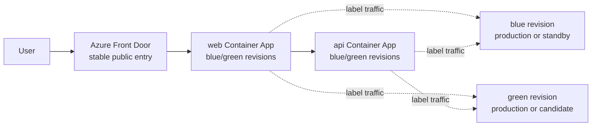

# blue/green デプロイメント戦略

この文書は、このリポジトリが Azure Container Apps (ACA) 上で blue/green デプロイを安全に行うための設計方針をまとめたものです。実行手順は [`demo-guide.md`](./demo-guide.md) と [`demo-guide-manual.md`](./demo-guide-manual.md) に任せ、ここでは「なぜこの構成で本番トラフィックを守れるか」と「どの状態を何が管理するか」に焦点を当てます。

## 概略

本サンプルでは `web` と `api` の 2 つの Container App を blue/green の対象にします。どちらも ACA の複数リビジョンモードで動かし、`blue` / `green` のリビジョンラベルと ingress traffic weight で本番と candidate を切り替えます。



重要な方針は次のとおりです。

| 項目 | 方針 |
| --- | --- |
| 切替単位 | `web` と `api` を常に同じ色へ一括で promote / rollback する |
| 本番入口 | Front Door は `web` の安定した Container App FQDN を origin にする |
| 切替場所 | Front Door ではなく ACA ingress traffic で切り替える |
| candidate 検証 | ACA のリビジョンラベル FQDN (`web---green...` など) を使う |
| バージョン | `infra.parameters.appVersion` を唯一の出所にする |
| 安全性 | デプロイ時は Bicep の宣言的 traffic で candidate を 0% に固定する |

Front Door は blue/green の切替点ではありません。Front Door は常に `web` Container App の通常 FQDN へルーティングし、その先で ACA が `blue` / `green` の traffic weight を解決します。リビジョンラベル FQDN は本番経路ではなく、candidate を本番へ出す前に個別検証するための入口です。

## 実装の中心: 宣言的 traffic

blue/green の中核は [`AspireBlueGreen.AppHost\AppHost.cs`](../AspireBlueGreen.AppHost/AppHost.cs) の `ConfigureBlueGreen` です。`api` と `web` の両方を `PublishAsAzureContainerApp` で publish し、ACA の `activeRevisionsMode` を `Multiple` にします。

`ConfigureBlueGreen` は、デプロイされるリビジョンの suffix と ingress traffic を Bicep に宣言します。

```text
revisionSuffix = 'v' + replace(appVersion, '.', '-')

traffic = concat(
  empty(blueRevisionSuffix)  ? [] : [{ revisionName: '<app>--<blueRevisionSuffix>',  label: 'blue',  weight: productionLabel == 'blue'  ? 100 : 0, latestRevision: false }],
  empty(greenRevisionSuffix) ? [] : [{ revisionName: '<app>--<greenRevisionSuffix>', label: 'green', weight: productionLabel == 'green' ? 100 : 0, latestRevision: false }]
)
```

この設計により、`az deployment` が新しいリビジョンを作る瞬間も、本番ラベル以外は 0% に固定されます。デプロイ後にスクリプトで慌てて traffic を戻す方式ではなく、リソース適用そのものが `production=100% / candidate=0%` を宣言するため、新リビジョンが一時的に本番トラフィックを奪う隙間を作りません。

`latestRevision: false` も重要です。traffic は「最新リビジョン」ではなく、`web--v1-1-0` / `api--v1-1-0` のような決定的なリビジョン名を参照します。そのため、どの色がどのバージョンを担うかを `*RevisionSuffix` で明示できます。

## バージョンとリビジョンサフィックス

`appVersion` は次の 3 か所に使われる、リリースバージョンの唯一の出所です。

| 利用先 | 内容 |
| --- | --- |
| API | `APP_VERSION` 環境変数として `/api/version` に表示 |
| web | Docker build arg としてバナー表示へ反映 |
| ACA revision | `v` + `appVersion` の `.` を `-` に置換した suffix |

例: `appVersion=1.1.0` の場合、リビジョンサフィックスは `v1-1-0` になり、リビジョン名は `web--v1-1-0` / `api--v1-1-0` になります。

この suffix は決定的なので、同じ `appVersion` を再デプロイすると同じリビジョン名を作ろうとして失敗します。`scripts\bluegreen-deploy.ps1` は `az deployment` の前に既存リビジョンを確認し、同じ suffix があれば早期に停止します。デプロイごとに未使用の新しいバージョンを指定してください。

## 状態モデル

このサンプルには、宣言的状態とスクリプト用ミラー状態の 2 種類があります。

| 状態 | 保存先 | 役割 |
| --- | --- | --- |
| `infra.parameters.productionLabel` | `azd env config` | Bicep が 100% にする本番色 |
| `infra.parameters.blueRevisionSuffix` | `azd env config` | blue ラベルが指す revision suffix |
| `infra.parameters.greenRevisionSuffix` | `azd env config` | green ラベルが指す revision suffix |
| `ACTIVE_LABEL` | `azd env` | status / promote / rollback が読む現在の本番色のミラー |
| `PREVIOUS_ACTIVE_LABEL` | `azd env` | rollback 先のミラー |

正の状態は `infra.parameters.*` です。`AppHost.cs` から生成される Bicep はこの値を読んで traffic を宣言します。一方、`ACTIVE_LABEL` / `PREVIOUS_ACTIVE_LABEL` は PowerShell スクリプトが表示や rollback 先の判断に使う補助的な状態です。

full promote と rollback では、まず `az containerapp ingress traffic set` で即時に traffic を動かし、その後に `infra.parameters.productionLabel` と `ACTIVE_LABEL` / `PREVIOUS_ACTIVE_LABEL` を同期します。これにより、次回の `az deployment` でも切替後の本番色が維持されます。

## 初回デプロイ時の seed

[`scripts\up.ps1`](../scripts/up.ps1) は、初回デプロイが無人で通るように不足している値を seed します。

| 値 | 初期値 | 意味 |
| --- | --- | --- |
| `infra.parameters.appVersion` | `1.0.0` | 初期リリースバージョン |
| `infra.parameters.productionLabel` | `blue` | 初期本番色 |
| `infra.parameters.blueRevisionSuffix` | `v1-0-0` | blue が担う初期 revision |
| `infra.parameters.greenRevisionSuffix` | 空文字 | green はまだ存在しない |
| `ACTIVE_LABEL` | `blue` | スクリプト用ミラー |

`greenRevisionSuffix` が空の場合、green の traffic entry は Bicep から省略されます。初回は blue だけが存在し、blue が 100% です。`up.ps1` は `productionLabel` が未設定の場合にだけ seed するため、再実行しても promote / rollback 済みの宣言的状態を上書きしません。

## デプロイと切替の流れ

### 1. candidate を 0% でデプロイする

[`scripts\bluegreen-deploy.ps1`](../scripts/bluegreen-deploy.ps1) は、現在の本番色ではない方を candidate として扱います。たとえば本番が blue の場合、candidate は green です。

このスクリプトは次の状態だけを更新します。

```text
infra.parameters.appVersion = 1.1.0
infra.parameters.greenRevisionSuffix = v1-1-0
infra.parameters.productionLabel = blue のまま
```

その後 `aspire publish` + `az deployment` を実行します。Bicep は `productionLabel=blue` を読んで `blue=100% / green=0%` を宣言するため、新しい green リビジョンは作成直後から 0% に駐車されます。

`up.ps1` 経由のデプロイでは [`azure.yaml`](../azure.yaml) の postdeploy hook が実行され、[`scripts\configure-frontdoor-origin.ps1`](../scripts/configure-frontdoor-origin.ps1) が Front Door の origin / route を `web` の安定 FQDN に配線し、[`scripts\reconcile-traffic.ps1`](../scripts/reconcile-traffic.ps1) が traffic が宣言どおりかを検証します。`reconcile-traffic.ps1` は traffic を変更しません。`bluegreen-deploy.ps1` 単体では postdeploy hook は走らないため、必要なら `reconcile-traffic.ps1` を手動実行して検証します。

### 2. ラベル FQDN で candidate を検証する

[`scripts\bluegreen-status.ps1`](../scripts/bluegreen-status.ps1) は、各アプリの traffic と label URL を表示します。ACA のリビジョンラベルは次の形で公開されます。

```text
https://<app>---<label>.<environment-default-domain>
```

green を検証する場合は `web---green...` と `api---green.../api/version` を確認します。本番 Front Door 経由はまだ blue のままです。

`/api/version` は SQL に依存しないため、blue/green の主要な検証エンドポイントとして使えます。`/api/orders` は SQL を使うため、SQL 接続や権限の検証は別観点として扱います。

### 3. full promote する

[`scripts\bluegreen-promote.ps1`](../scripts/bluegreen-promote.ps1) は、`web` と `api` の両方に対して `az containerapp ingress traffic set` を実行し、candidate を 100% にします。

本番 blue から green へ完全昇格する場合の状態遷移は次のとおりです。

| タイミング | traffic | 宣言的状態 | ミラー状態 |
| --- | --- | --- | --- |
| promote 前 | blue=100 / green=0 | `productionLabel=blue` | `ACTIVE_LABEL=blue` |
| traffic set 直後 | blue=0 / green=100 | まだ `productionLabel=blue` | まだ `ACTIVE_LABEL=blue` |
| 同期後 | blue=0 / green=100 | `productionLabel=green` | `ACTIVE_LABEL=green`, `PREVIOUS_ACTIVE_LABEL=blue` |

この同期が重要です。同期後は次回 `az deployment` を実行しても、Bicep が green を本番 100% として再適用します。

### 4. canary する

`bluegreen-promote.ps1 -CandidateWeight 20` のように 100 未満の weight を指定すると、candidate に一部だけ流す canary ができます。

canary は命令的 traffic と宣言的状態が一時的に乖離する状態です。たとえば本番 blue で green を 20% にした場合、実 traffic は `blue=80 / green=20` ですが、`productionLabel` はまだ `blue` のままです。これは、まだ green を正式な本番色として確定していないためです。

この状態で `az deployment` を実行すると、Bicep は宣言的状態どおり `blue=100 / green=0` を再適用し、canary の split を消します。canary 中は `az deployment` を避け、問題なければ `-CandidateWeight 100` で full promote して宣言的状態を同期してください。

### 5. rollback する

[`scripts\bluegreen-rollback.ps1`](../scripts/bluegreen-rollback.ps1) は、`PREVIOUS_ACTIVE_LABEL` を rollback 先として扱います。traffic を即時に戻し、その後 `productionLabel` とミラー状態を同期します。

rollback は再ビルドや再デプロイではなく、残っている既存リビジョンへ traffic を戻す操作です。そのため、rollback できるかどうかは対象の古いリビジョンが ACA に残っていることに依存します。古いリビジョンの保持期間や整理方針は、実運用では別途決める必要があります。

## 宣言的制御と命令的制御の責務分担

このサンプルは、デプロイ時の安全性と切替時の即時性を両立するためにハイブリッドな制御を採用しています。

| 操作 | 制御方法 | 理由 |
| --- | --- | --- |
| 新リビジョンの作成 | Bicep の宣言的 traffic | `az deployment` 中に candidate が本番 traffic を奪わないようにする |
| postdeploy 確認 | `reconcile-traffic.ps1` の検証 | 宣言どおりかを確認し、ポータル編集などの乖離に気づく |
| full promote | 命令的 traffic set + 宣言的状態同期 | 即時に切替え、次回 deploy でも維持する |
| canary | 命令的 traffic set のみ | まだ本番色を確定しないため、宣言的状態は変えない |
| rollback | 命令的 traffic set + 宣言的状態同期 | 即時復旧し、次回 deploy でも rollback 状態を維持する |

`reconcile-traffic.ps1` は「修正」ではなく「検証」です。traffic をポータルなどで手動編集して宣言的状態とずれた場合は、スクリプトが警告します。恒久的な本番色の変更は `bluegreen-promote.ps1` または `bluegreen-rollback.ps1` で行い、宣言的状態も同期してください。

## 運用上の注意点

- `web` と `api` は片側だけ切り替えない。UI と API のバージョン不整合を避けるため、必ず一括で promote / rollback する。
- `appVersion` はデプロイごとに新しい値にする。同じバージョンは同じ revision suffix になる。
- canary 中に `az deployment` しない。宣言的状態が再適用され、canary split が失われる。
- Front Door で blue/green を切り替えない。Front Door は `web` の安定 FQDN へ向け、切替は ACA traffic が担う。
- candidate 検証は label FQDN で行う。本番 Front Door URL は promote まで旧本番色を返す。
- rollback は既存リビジョンへ traffic を戻す操作なので、古いリビジョンを削除すると rollback 先を失う。
- `/api/version` は SQL 非依存の確認に使える。SQL を使う `/api/orders` の問題とは切り分けて判断する。

## 実装参照

| ファイル | 役割 |
| --- | --- |
| [`AspireBlueGreen.AppHost\AppHost.cs`](../AspireBlueGreen.AppHost/AppHost.cs) | AppHost、宣言的 blue/green traffic、revision suffix |
| [`azure.yaml`](../azure.yaml) | azd 設定と postdeploy hook |
| [`scripts\up.ps1`](../scripts/up.ps1) | platform + `aspire publish` + `az deployment`、初期状態 seed |
| [`scripts\bluegreen-deploy.ps1`](../scripts/bluegreen-deploy.ps1) | candidate を 0% でデプロイ |
| [`scripts\bluegreen-promote.ps1`](../scripts/bluegreen-promote.ps1) | promote / canary |
| [`scripts\bluegreen-rollback.ps1`](../scripts/bluegreen-rollback.ps1) | rollback |
| [`scripts\bluegreen-status.ps1`](../scripts/bluegreen-status.ps1) | traffic と label URL の表示 |
| [`scripts\reconcile-traffic.ps1`](../scripts/reconcile-traffic.ps1) | 宣言的 traffic の検証 |
| [`scripts\configure-frontdoor-origin.ps1`](../scripts/configure-frontdoor-origin.ps1) | Front Door origin / route の配線 |
| [`docs\demo-guide.md`](./demo-guide.md) | スクリプト版デモ手順 |
| [`docs\demo-guide-manual.md`](./demo-guide-manual.md) | 手動実行版デモ手順 |
